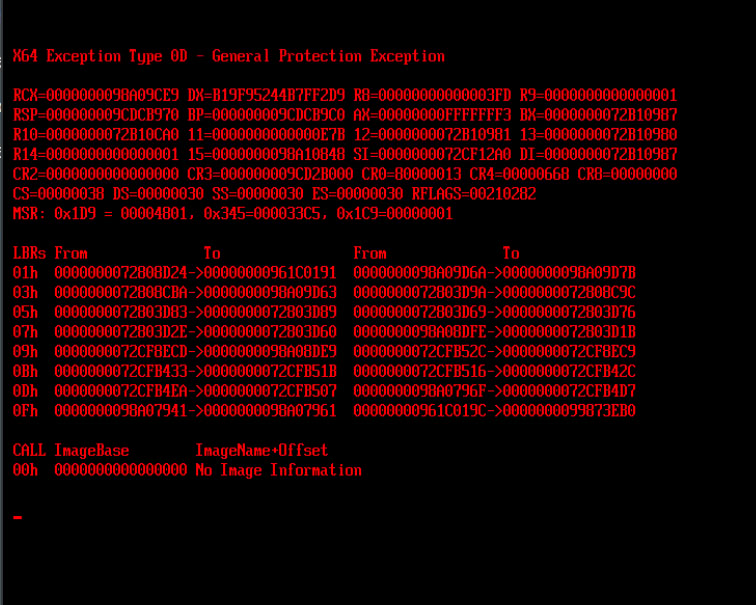

# 2025 年 10 月 5 日工作总结

本次主要工作是 PVE 8 升级到 PVE 9，以及清退最晚 2025/1/1 之前有有效登录的用户。

## 升级

执行 `pve8to9` 排查升级问题，包括：

- 使用 chrony 替换 systemd-timesyncd
- 安装 intel-microcode
- `echo 'grub-efi-amd64 grub2/force_efi_extra_removable boolean true' | debconf-set-selections -v -u` 然后重装 GRUB

替换 bookworm -> trixie 后升级参考命令：

```sh
apt dist-upgrade --no-install-recommends linux-sysctl-defaults
```

升级后 `apt autoremove` 并 `apt modernize-sources`。pvestrap 也已更新。

发现的问题：

1. pvg2 的 IPMI 网络无法访问，故不重启
2. pvg1 一根内存条处于 degraded 状态
3. pv8 一块盘自检有问题（可能是之前换下来的坏盘插了上去）
4. pv6 安装新 GRUB 后重启 UEFI 提示 General Protection Exception，无法启动，不得不降级到 Bookworm 的 grub-efi-amd64 版本。HPE UEFI 显示如下：

    

    救援方法：挂载 [ustc.ipxe.iso](https://ftp.lug.ustc.edu.cn/PXE/image/ustc.ipxe.iso)（很小），然后在启动的 grub 里面按 `c` 进入命令行，手动加载内核和 initrd 启动系统。命令如下：

    ```grub
    insmod part_gpt
    insmod ext2
    insmod lvm
    set root=(lvm/pve-root)
    linux /boot/vmlinuz-6.14.11-3-pve root=/dev/mapper/pve-root ro
    initrd /boot/initrd.img-6.14.11-3-pve
    boot
    ```

## 清退

流程与 [2024-10-01](./2024-10-01.md) 中类似，未发现问题。
