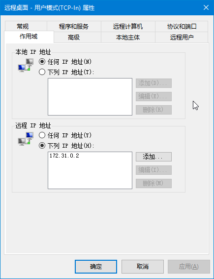

# 打包 Windows 镜像

!!! danger "警告"

    打包和维护 Windows 镜像非常麻烦并且很难 debug，<big><b>快跑！！！</b></big>

    <big><b>You have been warned. Run!!!</b></big>

由于 Proxmox VE 上的虚拟机使用 cloud-init 进行定制，并且 Windows 和 Unix 一套体系完全不在一个频道上，所以制作可以用 cloud-init 即使只是简单定制的 Windows 镜像也非常折腾。~~下面让我们一起来受罪吧！~~

## 一、准备虚拟机 {#setup-vm}

### 安装虚拟机 {#install-vm}

学校买了正版的 Windows 10，可以在[软件正版化](https://zbh.ustc.edu.cn/)网站上下载，建议选中文版（因为是面向用户的）。旁边的 KMS 注册文件不用下载，实际只需要一行命令就能解决，后面会提到。

同时也要下载 [VirtIO Windows 驱动][virtio-win]，选 Stable ISO。

  [virtio-win]: https://github.com/virtio-win/virtio-win-pkg-scripts#downloads

- 创建一个虚拟机，选择一个 ID 和名称
- OS 页面注意在右边的 Guest OS 正确选择 Windows 10
- System 页面勾上 Qemu Agent，将 SCSI Controller 改为 Default
- **硬盘总线选 SATA**，存储和容量自定，推荐 32 GB 就够，除非你还要额外安装软件（建议别自找麻烦）
- CPU 内存按需分配，4 核 8 GB 算高配了
- 网卡接在 vmbr1 上（也就是用户内网），不然后面还有麻烦 :octicons-alert-24:
- 最后的确认页面先**不要**勾选 Start after created，创建完成后去添加一个串口设备（Serial 0），后面会用到

和一般的虚拟机安装过程一样，将 ISO 添加为 CD/DVD Drive，跟着安装程序走完流程即可，版本请选择**教育版**。

第一次重启后进入 Windows 的 OOBE，现在可以在后台把光驱换成 VirtIO 的驱动盘了。

### Windows OOBE

OOBE 阶段可以自行配置，不过既然是要用作面向用户的模板，选择一些设置时稍微考虑一下。

地区语言当然是中文了，键盘微软拼音（这是默认，下一步），然后一路到创建账户这里会有个错误提示码 OOBEAADV10，忽略掉它创建一个本地账户，命名为 Vlab，密码留空（不然后面要你填三个安全问题，WTF?）。

??? note "错误码 OOBEAADV10"

    这是 Windows 在尝试连接到 Azure Active Directory 时报的错，因为这个时候只有 IPv6 网络是通的（有 SLAAC），用户内网没有 DHCP。

位置服务、广告标识符这个页面全部关掉，Cortana 也别开，都是些浪费时间和资源的东西。

到这里就差不多进入桌面了，目前为止没有太多坑，除了密码必须留空之外（嗯，这种地方要求填安全问题是个奇怪的设定）。

## 二、配置虚拟机 {#configure-vm}

### 暂停 Windows 更新 {#pause-windows-update}

!!! danger "不然网络通畅后开始自动更新了，后面你就麻烦了"

### 设置网络 {#configure-networking}

右键点击右下角的网络图标，打开“网络和 Internet”设置，在下面选择“更改适配器选项”，打开“以太网实例 0”的属性，再选中 Internet 协议版本 4，在这里指定一个临时的 IPv4 地址（参考[打包容器的流程](pack-ct-image.md#prepare-ct)），掩码是 `255.255.0.0`，网关是 `172.31.0.1`，DNS 服务器和网关一样，确定完成后就能上网了。

!!! danger "不要直接在“设置”应用里改"

    “设置”里直接改的时候，指定静态 IPv4 的时候就没有 IPv6 自动配置了。

### 激活 Windows {#activate-windows}

右键点击左下角的 :fontawesome-brands-windows: Windows，打开一个有管理员权限的 PowerShell 窗口，配置学校的 KMS 激活：

```bat
slmgr.vbs /skms kms.ustc.edu.cn
```

现在可以进设置应用里查看激活状态了。如果还没激活的话，点疑难解答，等它跑完就会告诉你已激活。

### 安装 VirtIO 驱动 {#install-virtio-drivers}

打开光驱运行 `virtio-win-guest-tools.exe`，一路下一步安装即可。

这里唯一的坑点是，如果你在创建虚拟机时没有多一步添加一个串口设备的话，那么 VirtIO 串口驱动就不会安装，需要关机加好设备后再重新安装。

QEMU Guest Agent (Qemu GA) 以后会很有用，我们也把它装上吧。

### 设置 RDP {#enable-rdp}

设置 → 系统 → 远程桌面，启用远程桌面。

配置 Windows 防火墙仅运行来自 web 服务器的连接：

- 打开 Windows Defender 防火墙设置（开始菜单 → Windows 管理工具，或者直接运行 `wf.msc`）
- 入站规则，找到 **远程桌面 - 用户模式 (TCP-In)** 启用，打开属性，切换到“作用域”选项卡，设置远程 IP 仅限 `172.31.0.2`，如图：

    

- （可选，推荐）入站规则里“核心网络诊断 - ICMP 回显请求”四个都打开（Windows 默认<del>近平</del>禁 ping，打开会方便以后调试网络和监测状态）

### 其他自定义设置 {#extra-customizations}

任务栏里那块巨大的胶布（搜索框）可以隐藏起来，Cortana 图标隐藏起来，Task View 的图标也可以隐藏起来，这几个都是右键任务栏就可以勾选的选项。

任务栏设置里的“使用‘速览’预览桌面”出于性能考虑建议不要开，其他随意，例如“合并任务栏按钮”可以改成“任务栏已满时”等等，其他的桌面背景、颜色、开始菜单等都随意。

:material-alert:{: .orangered } 开始菜单里预装的 UWP 应用现在**不要动**，否则后面 Sysprep 的时候会出错。（如果你特别想删掉其中的一个或多个时，[第四节清理](#cleanup)有详细说明。）

Windows 检测网络连接的功能经常坏，原因是 msftconnecttest.com 服务器在国外，很慢而且不稳定，可以修改注册表将这个功能替换成使用校内的服务。

??? abstract "注册表文件"

    ```registry
    Windows Registry Editor Version 5.00

    [HKEY_LOCAL_MACHINE\SYSTEM\CurrentControlSet\Services\NlaSvc\Parameters\Internet]
    "ActiveDnsProbeContent"="202.38.64.1"
    "ActiveDnsProbeContentV6"="2001:da8:d800::1"
    "ActiveDnsProbeHost"="ns.ustc.edu.cn"
    "ActiveDnsProbeHostV6"="ns.ustc.edu.cn"
    "ActiveWebProbeContent"="USTC Mirrors Connect Test"
    "ActiveWebProbeContentV6"="USTC Mirrors Connect Test"
    "ActiveWebProbeHost"="mirrors.ustc.edu.cn"
    "ActiveWebProbeHostV6"="ipv6.mirrors.ustc.edu.cn"
    "ActiveWebProbePath"="connecttest.txt"
    "ActiveWebProbePathV6"="connecttest.txt"
    "EnableActiveProbing"=dword:00000001
    ```

## 三、安装 Cloudbase-init {#cloudbase-init}

!!! danger "警告：前方雷区"

下载地址 <https://cloudbase.it/downloads/CloudbaseInitSetup_Stable_x64.msi>，可以浏览器下载，也可以 PowerShell 命令行：

```powershell
Invoke-WebRequest -Uri https://cloudbase.it/downloads/CloudbaseInitSetup_Stable_x64.msi -OutFile C:\cloudbase-init.msi
```

顺着 Cloudbase-init 的流程安装就行，在选择用户名的那个界面填 Administrator，下面串口设备选择 COM1，继续安装完成。最后一个界面**不要**选 Sysprep，直接关闭退出，等改完设置后手动处理。

安装完成后打开 `C:\Program Files\Cloudbase Solutions\Cloudbase-init\conf`，编辑 `cloudbase-init-unattend.conf`，修改以下几处：

- 确保 username=Administrator 和 groups=Administrators
- 添加一行 `first_logon_behaviour=no`
- 删除 `config_drive_raw_hhd` 和 `config_drive_vfat`（或者改成 false 也行）
- 从 `metadata_services` 里删掉其他配置，只保留一个 `ConfigDriveService`。注意这是一个逗号分隔的列表，不要看错了
- 将 `check_latest_version` 改成 false

??? abstract "参考：修改后的文件内容"

    ```ini
    [DEFAULT]
    username=Administrator
    groups=Administrators
    inject_user_password=true
    first_logon_behaviour=no
    config_drive_cdrom=true
    bsdtar_path=C:\Program Files\Cloudbase Solutions\Cloudbase-Init\bin\bsdtar.exe
    mtools_path=C:\Program Files\Cloudbase Solutions\Cloudbase-Init\bin\
    verbose=true
    debug=true
    logdir=C:\Program Files\Cloudbase Solutions\Cloudbase-Init\log\
    logfile=cloudbase-init-unattend.log
    default_log_levels=comtypes=INFO,suds=INFO,iso8601=WARN,requests=WARN
    logging_serial_port_settings=COM1,115200,N,8
    mtu_use_dhcp_config=true
    ntp_use_dhcp_config=true
    local_scripts_path=C:\Program Files\Cloudbase Solutions\Cloudbase-Init\LocalScripts\
    check_latest_version=false
    metadata_services=cloudbaseinit.metadata.services.configdrive.ConfigDriveService
    plugins=cloudbaseinit.plugins.common.mtu.MTUPlugin,cloudbaseinit.plugins.common.sethostname.SetHostNamePlugin,cloudbaseinit.plugins.windows.extendvolumes.ExtendVolumesPlugin
    allow_reboot=false
    stop_service_on_exit=false
    ```

## 四、打包前的清理工作 {#cleanup}

- :material-alert:{: .orangered } **启用 Windows Update**

    !!! tip "可以放在最后一步关机前再启用，避免后面清理时间太长导致 WU 开始运行，或者直接断网也行。"

- **清理 Windows 资源管理器的历史记录**

    按 <kbd>:fontawesome-brands-windows: Windows</kbd> + <kbd>E</kbd> 打开 Windows 资源管理器，删掉所有“最近文件”。注意不是将文件从磁盘上删除，而是右键“从快速访问中删除”。

- **清理“运行……”的历史记录**

    清空（不是删除）注册表项 `HKEY_CURRENT_USER\Software\Microsoft\Windows\CurrentVersion\Explorer\RunMRU` 中的所有内容。

- **清理浏览器记录**

    对于 Internet Explorer：请参考 Microsoft Docs（[中文](https://support.microsoft.com/zh-cn/windows/%E5%9C%A8-internet-explorer-%E4%B8%AD%E6%9F%A5%E7%9C%8B%E5%92%8C%E5%88%A0%E9%99%A4%E6%B5%8F%E8%A7%88%E5%8E%86%E5%8F%B2%E8%AE%B0%E5%BD%95-098ffe52-5ac9-a449-c296-c735c32c8678) / [English](https://support.microsoft.com/en-us/windows/view-and-delete-your-browsing-history-in-internet-explorer-098ffe52-5ac9-a449-c296-c735c32c8678))

    对于 Microsoft Edge：清空目录 `C:\Users\Vlab\AppData\Local\Microsoft\Edge`

- **进行磁盘清理**

    打开“此电脑”，右键点击 C 盘选择“属性”，然后在对话框中找到“磁盘清理”选项。先点击左下角“清理系统文件”，然后勾选全部内容确认清理。

- **关闭休眠和快速启动**（推荐）

    以管理员打开 PowerShell，运行 `powercfg /h off`。

- （可选）**删除预装的 UWP 应用**

    ??? info "这是高级操作，建议仅当你熟悉 Windows 10 时进行"

        以管理员打开 PowerShell，运行 `:::powershell Get-AppxProvisionedPackage -Online` 来列出当前系统中已预装的 UWP 应用。对于每一个想要删除的应用，记录下 PackageName。

        继续在 PowerShell 中，运行 `:::powershell Remove-AppxProvisionedPackage -Online -PackageName $PackageName`，其中 `$PackageName` 替换成刚才记录下来的 PackageName。删除预装后，也要**同时删除当前用户已安装的这一份相同应用**。你可以使用 `:::powershell Remove-AppxPackage -PackageName $PackageName` 命令，也可以直接在开始菜单中找到它选择“卸载”（如果你找得到的话）。

        作为练习，你可以选择删除 Microsoft Solitaire Collection 和 Skype 这两个应用，或者选择跳过这一步。

## 五、Sysprep 和打包 {#sysprep}

!!! tip "先关机打一个快照"

    Sysprep 后的镜像无法恢复，因此我们推荐在这一步之前将虚拟机关机，在 Proxmox 的界面中打一个快照，方便以后以当前状态为基础进一步定制镜像。

还是以管理员打开 PowerShell，定位到 `C:\Program Files\Cloudbase Solutions\Cloudbase-init\conf`，运行 Sysprep：

```cmd
C:\Windows\System32\Sysprep\sysprep.exe /generalize /oobe /unattend:Unattend.xml
```

这个 `Unattend.xml` 由 Cloudbase-init 提供，所以需要先 `cd` 到上述目录。

如果 Sysprep 出现错误，请检查 `C:\Windows\System32\Sysprep\Panther\setupact.log` 并利用 Google 排查。

??? danger "不正确地卸载预装的 UWP 应用会导致 Sysprep 失败"

    `setupact.log` 中能看到以下错误信息，以 Microsoft Solitaire Collection 为例：

    ```text
    Package Microsoft.MicrosoftSolitaireCollection_4.10.7290.0_neutral_~_8wekyb3d8bbwe was installed for a user, but not provisioned for all users. This package will not function properly in the sysprep image.
    ```

    请回到第四节正确卸载错误信息给出的软件包。

Sysprep 运行完成后 Windows 会自动关机，**此时就不要再开机了**，把当前版本的虚拟机镜像提取出来，就算打包完成了。你也可以选择直接将这个虚拟机转换为 Template，就可以直接从它创建出新虚拟机了。

### 提取虚拟机镜像 {#packaging}

首先请参考[打包容器镜像](pack-ct-image.md#packaging)对应的一节激活虚拟机对应的 LVM 卷。

??? tip "提取虚拟机的快照"

    如果你想提取虚拟机的某个快照，而不是其当前状态，需要在 `lvchange` 命令中额外添加 `-Ky` 参数。

    ```shell
    lvchange -ay -Ky /dev/{vg}/{lv}
    ```

然后，使用 QEMU 的磁盘工具将存储在 LVM 中的原始（raw）磁盘镜像提取出来：

```shell
qemu-img convert -p -f raw -O qcow2 /dev/{vg}/{lv} win10.qcow2
```

此时 `win10.qcow2` 就可以使用了。它的容量通常在 20 GB 以上，可能还不够方便移动，下面提供一种简单的优化方法。

### 优化虚拟机镜像 {#optimize-image}

Linux 下对 NTFS 文件系统写入没有很好的优化，容易损坏文件系统，因此请将上一步提取得到的 qcow2 文件作为另一个虚拟磁盘挂载进 Windows 虚拟机，从 Windows 中操作。

- **删除页面文件和交换文件**

    打开刚挂载的磁盘中的系统分区（它的盘符现在应该不是 C 了，注意辨别），删除 `pagefile.sys` 和 `swapfile.sys`。

    你也可以同时清空 `C:\Windows\Logs` 和一些其他文件夹，但这通常是不必要的，它们不会清理出几十 MB 的容量。

- **对文件系统执行 Trim**

    再次以管理员身份打开 PowerShell，执行以下命令：

    ```powershell
    Optimize-Volume -DriveLetter X -ReTrim -Defrag -SlabConsolidate -Verbose
    ```

    （如果命令运行得太慢了，你可以去掉 `-SlabConsolidate` 参数。）

以上任务完成后，关闭 Windows 虚拟机并解除挂载硬盘，然后再次转换并压缩镜像：

```shell
qemu-img convert -p -c -f qcow2 -O qcow2 win10.qcow2 win10-new.qcow2
```

此时的 `win10-new.qcow2` 容量应该能缩减至 10-12 GB，可以保存作为正式镜像了，刚才的 `win10.qcow2` 也可以删除或覆盖掉了。

## 参考资料 {#references}

- [[TUTORIAL] - windows cloud init working | Proxmox Support Forum](https://forum.proxmox.com/threads/windows-cloud-init-working.83511/)
